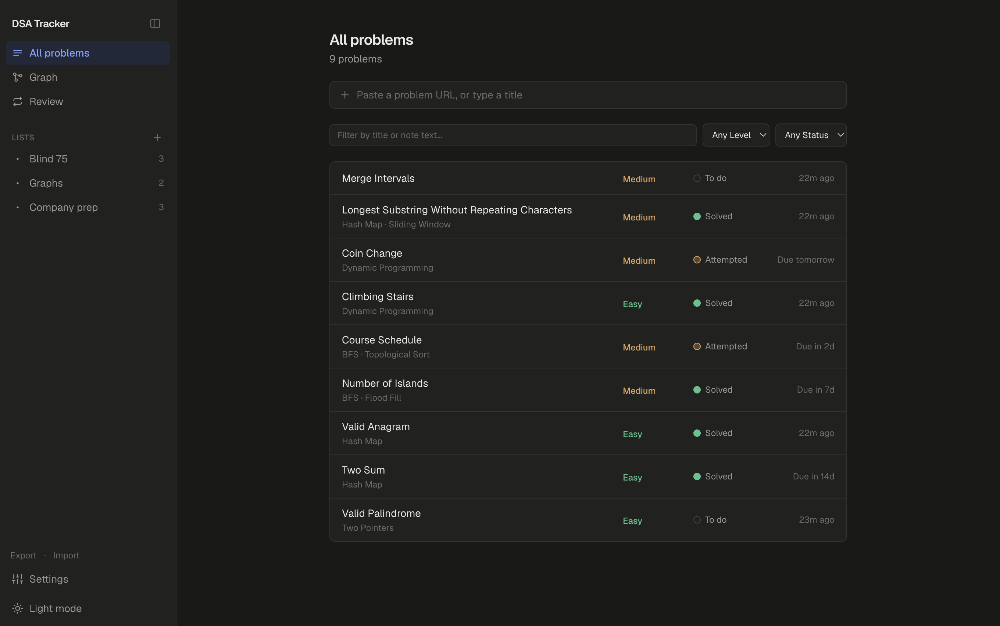
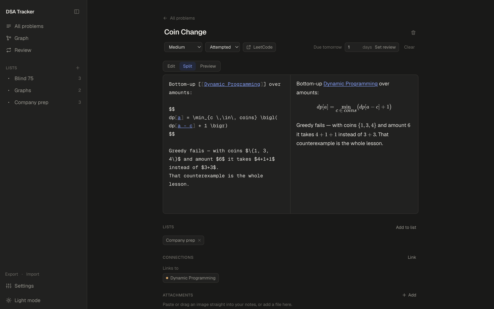
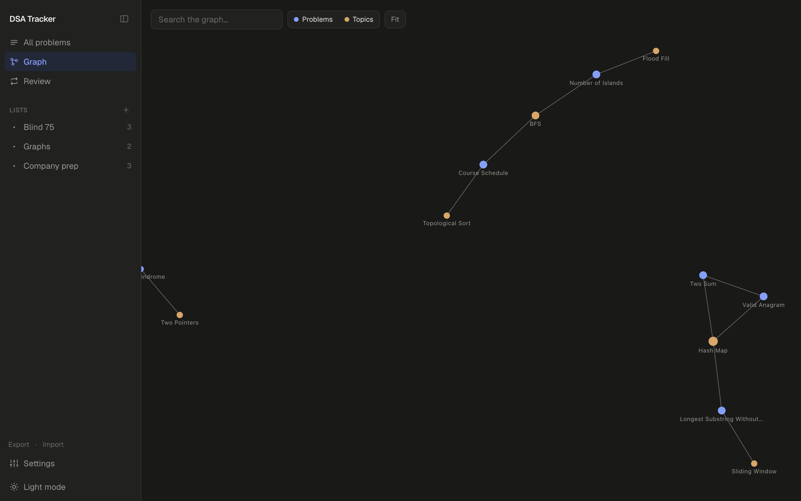
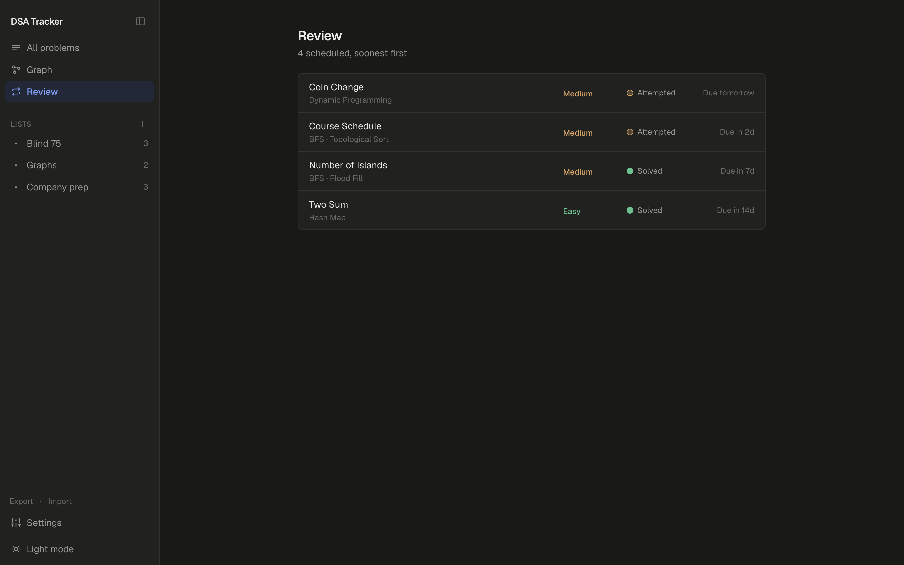

# DSA Tracker

**Your DSA practice, in one place that's actually yours.** Keep the problems you've solved, the
notes explaining *why* the solution works, the diagrams you drew figuring it out — and watch a
map of what you know build itself as you write.

Free, offline, and yours. No account, no sync, no server. Just an app.

[**Download for macOS, Windows or Linux →**](../../releases/latest)



---

## The problem with how most of us track DSA

You solve a problem. A week later you hit something similar and think *I've done this before* —
but the insight is gone. It's in a spreadsheet cell, or a comment on a solution you can't find,
or nowhere at all.

Spreadsheets track *that* you solved something. They're hopeless at *what you learned*. And
neither a spreadsheet nor a folder of notes can tell you the thing that actually matters: **these
six problems are all the same idea wearing different clothes.**

## Notes that hold a real explanation

Every problem gets a markdown editor with live preview and autosave. Write your approach, the
complexity, the edge case that caught you out.

**LaTeX works**, because complexity analysis without maths is painful. Type `$O(n \log n)$` inline,
or `$$…$$` for a centred block, and it renders as you write.



**Paste screenshots straight in.** Copy a diagram, hit ⌘V in the editor, and it uploads and embeds
itself. Photograph your handwritten working and drag it in. Everything stays attached to the
problem it belongs to.

Screenshots get compressed on the way in — a typical clipboard image drops by around 90% — so a
year of pasting doesn't quietly turn into gigabytes. If you'd rather keep them lossless, Settings
has a switch.

## A map that draws itself

Write `[[Sliding Window]]` in your notes and two things happen: the topic is created, and this
problem is linked to it. That's it. That's the whole system.

Do that while taking notes normally, and after a few weeks you have a genuine map of your own
understanding — without ever sitting down to "organise" anything.



Two problems that both mention `[[Hash Map]]` end up connected through it. Clusters appear where
you've gone deep; sparse corners show you where you haven't. Click any node to jump straight to it.

## Reviews you actually control

No mysterious algorithm deciding when you see something again. Finished a problem and want it back
in a fortnight? Type `14`, press **Set review**. The Review tab lists everything scheduled, soonest
first.



## Lists for however you're studying

"Blind 75", "Graphs", "Company prep" — a problem can sit in several lists at once and still have
one set of notes, so nothing gets duplicated or goes stale in one copy.

`⌘K` jumps to anything by name. Filters narrow by difficulty, status, or text — and the text
filter searches your note bodies, not just titles, so "monotonic" finds the problem where you
explained it.

---

## Download

Grab the installer for your system from the [latest release](../../releases/latest):

| System | File |
|---|---|
| macOS (Apple Silicon) | `DSA-Tracker-<version>-arm64.dmg` |
| macOS (Intel) | `DSA-Tracker-<version>-x64.dmg` |
| Windows | `DSA-Tracker-<version>-x64.exe` |
| Linux | `DSA-Tracker-<version>-x86_64.AppImage` or `-amd64.deb` |

**First launch.** These builds aren't code-signed — a certificate costs money every year, and this
is a free project — so your system asks for reassurance once:

- **macOS** — right-click the app in Applications, choose *Open*, then *Open* again.
- **Windows** — click *More info*, then *Run anyway*.

<details>
<summary>macOS says the app is "damaged"</summary>

You have a build from v0.2.0 or earlier, where the signature didn't cover the whole app bundle.
Download v0.2.1 or later. To open a copy you already have:

```bash
xattr -dr com.apple.quarantine "/Applications/DSA Tracker.app"
```
</details>

## Your notes are yours

Everything lives on your machine — a SQLite database and a folder of attachments:

| | Location |
|---|---|
| macOS | `~/Library/Application Support/DSA Tracker/vault/` |
| Windows | `%APPDATA%\DSA Tracker\vault\` |
| Linux | `~/.config/DSA Tracker/vault/` |

Nothing is uploaded anywhere. There is no account and no telemetry. **The app works with the
network switched off** — the only thing that needs internet is clicking through to a problem's
website.

And you're not locked in. **Export** produces a zip of plain markdown files with YAML frontmatter
and wiki-links intact — it opens as an Obsidian vault as-is, and **Import** reads it back. That's
also how you move your notes between machines.

---

## Building from source

```bash
npm install
npm run dev
```

That opens the app window with hot reload. There's no browser version — the app *is* the desktop
app, and `npm run dev` is the development loop for it. A separate vault under `data/` keeps
experiments away from your real notes.

To build installers:

```bash
npm run dist
```

They land in `dist/`. Each platform must be built on that platform, which is why releases come
from CI rather than one machine.

## How it works

The interface is a Next.js app; the desktop shell is Electron, which starts that server on a
private loopback port and points a native window at it. One implementation of every feature, not
two that drift apart.

That local server is **authenticated with a secret generated at launch**. An unauthenticated port
on `127.0.0.1` is reachable by more than the app that opened it — a web page you visit can send it
a cross-origin request, and on a shared computer so can any other account. Neither can obtain the
secret, so both get a `403`.

```
src/app/          pages and API routes
src/components/   UI
src/db/           schema.ts, client.ts, queries.ts  ← all data access
src/lib/          storage, wiki-link parsing, review scheduling
electron/         desktop shell: boots the server, owns the window and menus
drizzle/          migrations
```

Everything that can appear in the graph is a **node** (`problem` or `topic`) and every connection
is an **edge** — which is why tagging, linking and the graph are one mechanism rather than three
features.

| Command | What it does |
|---|---|
| `npm run dev` | Run the app with hot reload |
| `npm run desktop` | Run it as it ships, from a production build |
| `npm run dist` | Build installers for this platform |
| `npm run lint` | ESLint |
| `npm run db:generate` | Generate a migration after editing `src/db/schema.ts` |
